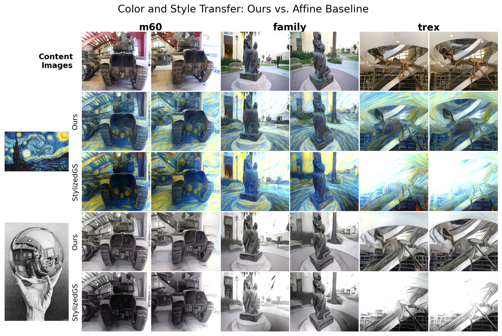
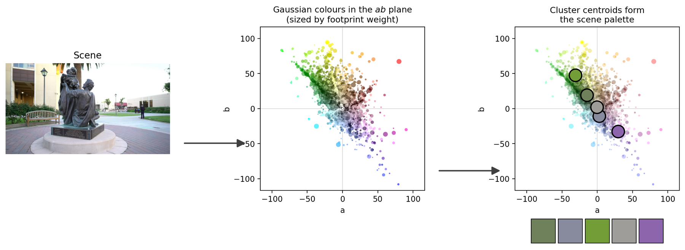
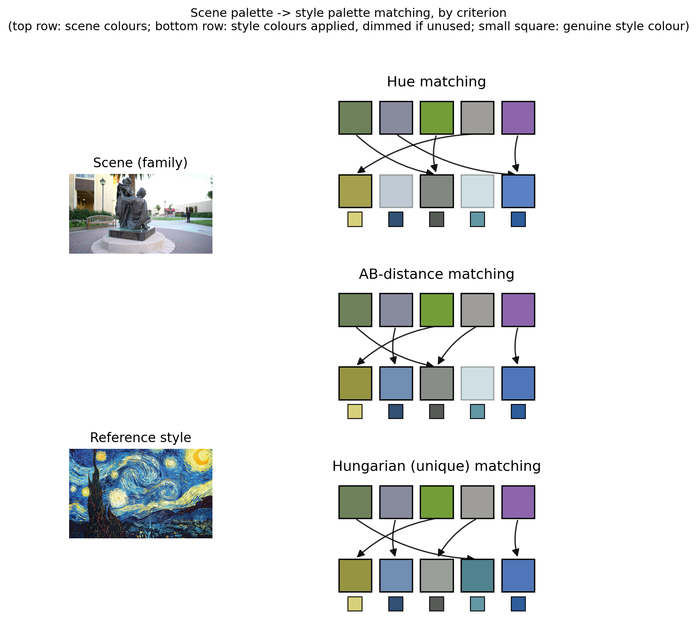
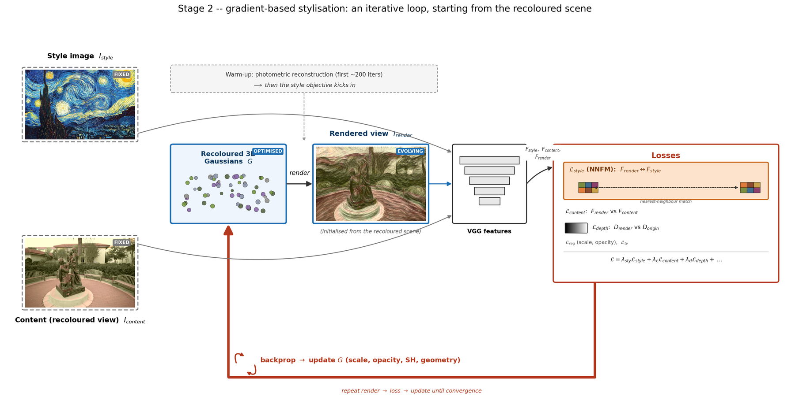
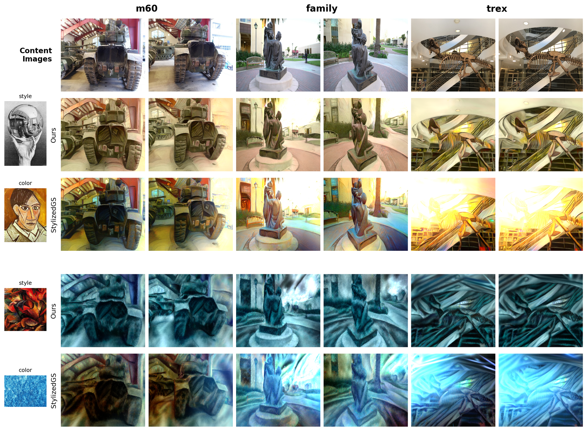
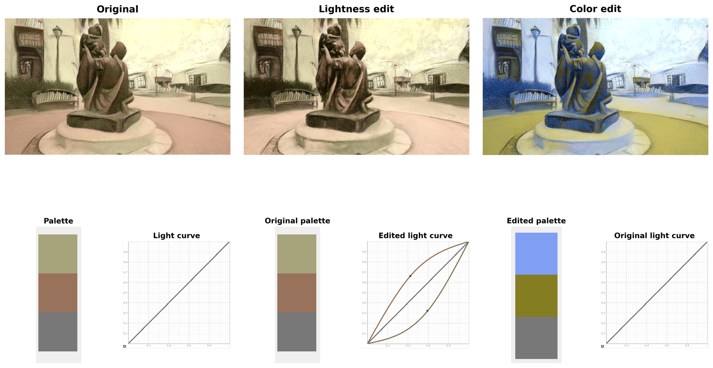

# PICASSO — Palette-Guided Stylization for 3D Gaussian Splatting

PICASSO is a TFM (Master's thesis) project built on top of [StylizedGS](https://github.com/Kristen-Z/StylizedGS). It splits 3D Gaussian Splatting stylization into two explicit stages instead of leaving everything to the gradient-based style loss:

1. **Global palette recoloring** — match the scene's color palette to the style image's palette and recolor the Gaussians directly (no backprop), using a from-scratch implementation of *Group-Theme Recoloring* ([Nguyen et al., Pacific Graphics 2017](grouptheme/README.md)).
2. **Gradient-based texture stylization** — starting from the recolored scene, optimize the Gaussians with an NNFM style loss (as in StylizedGS/ARF) so brush strokes and texture detail match the style image.

Decoupling color from texture means a style's **palette** and a style's **brushwork** can be controlled, swapped, or taken from two different reference images independently.

<p align="center">
  
</p>

## How it works

### Stage 1 — palette extraction, matching, and recoloring

Each Gaussian's SH0 color is projected to Lab space; the scene's palette is extracted from the `(a, b)` chroma plane and matched to the style image's palette, then every Gaussian is recolored by inverse-distance-weighted shift toward its matched target. Lightness `L` is left untouched — only hue/chroma move, so geometry and shading are unaffected. An optional adaptive **margin-pull** step (`utils/margin_pull.py`) snaps slightly undershooting colors the rest of the way to their target without overshooting ones that already landed well.

<p align="center">
  
</p>

Three interchangeable scene→style matching criteria are available (`--gt_match_by`):

| Mode | Description |
|---|---|
| `hue` | nearest hue angle, circular distance |
| `ab` | nearest neighbor in the `(a, b)` chroma plane |
| `unique` | Hungarian assignment — a one-to-one, globally optimal matching |

<p align="center">
  
</p>

Palette matching can also run in two modes (`--direct_match`): **group-theme**, which clusters the scene into `m` theme colors first (`--gt_theme_size`), or **direct**, which matches every scene palette color individually with no clustering step.

### Stage 2 — gradient-based stylization

The recolored scene is then optimized against the style image with an NNFM style loss, a content loss, a depth-consistency loss, and regularization on scale/opacity — the same loop StylizedGS uses, just initialized from an already-recolored scene instead of the raw reconstruction.

<p align="center">
  
</p>

### Decoupled style and color references

Because recoloring and texture transfer are separate stages, the palette can be pulled from a *different* image than the one driving brush strokes — e.g. apply Van Gogh's brushwork with a photograph's color grading, or vice versa (`--second_style`).

<p align="center">
  
</p>

### Post-hoc palette editing

Because the scene's theme palette is an explicit, addressable object, it can be edited directly after stylization — e.g. remapping individual theme colors or applying a lightness curve to the palette — without re-running the optimization.

<p align="center">
  
</p>

## Setup

### Installation

```bash
git clone --recursive <this-repo-url>
cd PICASSO
conda create -n picasso python==3.10
conda activate picasso
pip install torch==2.4.0 torchvision==0.19.0 --index-url https://download.pytorch.org/whl/cu124
pip install -r requirements.txt
pip install -e submodules/diff-gaussian-rasterization
pip install -e submodules/fused-ssim
pip install -e submodules/simple-knn
```

The palette pipeline also depends on the [`grouptheme`](../grouptheme) package, which lives as a sibling folder at the repo root (`../grouptheme` relative to `PICASSO/`) — it's already there if you cloned this repo, no extra install needed.

### Data preparation

Same layout as StylizedGS — [LLFF](https://bmild.github.io/llff/), [Tanks and Temples](https://www.tanksandtemples.org/), and [MipNeRF-360](https://jonbarron.info/mipnerf360/) scenes, plus a folder of reference style images:

```
datasets
|---llff/
|   |---flower/
|   |---...
|---tandt/
|---mipnerf360/
|---styles/
|   |---0.jpg
|   |---1.jpg
|   |---...
```

To process your own scenes, follow the [3DGS instructions](https://github.com/graphdeco-inria/gaussian-splatting#processing-your-own-scenes).

## Quick start

```bash
bash StylizedGS.sh [DATA_TYPE] [SCENE_NAME] [STYLE_ID]
# e.g. bash StylizedGS.sh llff flower 14
```

This reconstructs the scene (`train.py`, skipped if a checkpoint already exists), then runs the two-stage stylization (`train_style.py`) and renders a video (`render.py`). Edit the `data_dir`/`style_img` paths at the top of the script to point at your own `datasets/` location.

Key `train_style.py` flags for the palette stage:

| Flag | Meaning |
|---|---|
| `--direct_match` | match every scene palette color individually (skip group-theme clustering) |
| `--gt_theme_size` | number of group-theme colors `m` (ignored with `--direct_match`) |
| `--gt_match_by {hue,ab,unique}` | scene→style palette matching criterion |
| `--margin_pull` / `--margin_base_scale` | enable the adaptive margin-pull post-process and its radius scale |
| `--gt_l_strength` | how much lightness is allowed to shift (0 = hue/chroma only) |
| `--recolor_debug` | dump palette-mapping and ab-plane diagnostic figures alongside training |

`train_style_inv.py` runs the same pipeline but defers the color bake until *after* stylization instead of before it.

### Spatial and scale control

Spatial masking (`gen_lang_masks.py` + `--mask_dir`/`--second_style`) and style-pattern scale (`--scale_level`) work the same way as in StylizedGS — see the [original README](https://github.com/Kristen-Z/StylizedGS#controllable-stylization) for examples.

## Experiments

`experiments/` contains the scripts used to characterize the palette pipeline itself, independent of any single render:

- `margin_pull_sweep.py` / `margin_pull_sweep_multi.py` — sweep `margin_base_scale` to trade target-fidelity against chroma-diversity, single- and multi-scene.
- `matching_criterion_experiment.py` / `matching_multi_style_fig.py` — compare the `hue` / `ab` / `unique` matching criteria on the same scene–style pairs.

## Acknowledgements

Built on [StylizedGS](https://github.com/Kristen-Z/StylizedGS), [3D Gaussian Splatting](https://github.com/graphdeco-inria/gaussian-splatting), and [ARF](https://github.com/Kai-46/ARF-svox2). The palette stage reimplements *Group-Theme Recoloring for Multi-Image Color Consistency* (Nguyen, Price, Cohen, Brown — Pacific Graphics 2017); see [`grouptheme/README.md`](../grouptheme/README.md) for implementation notes.
